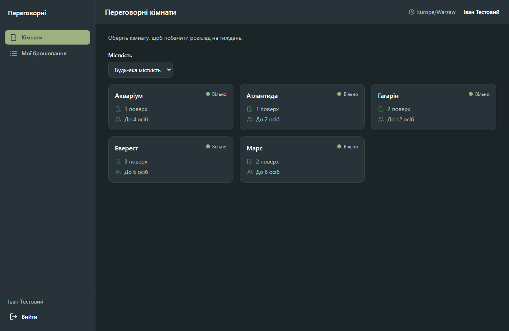
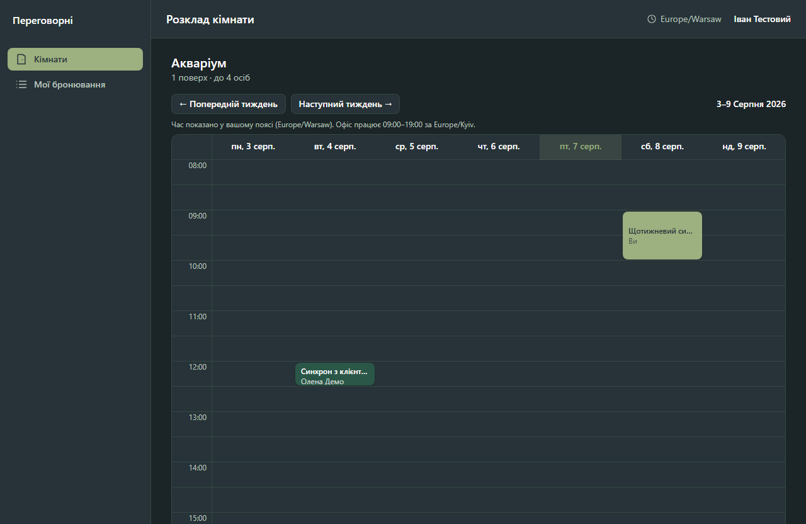
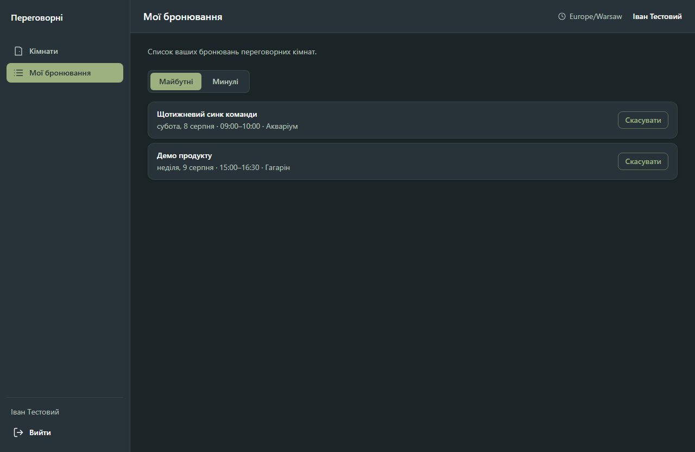

# Бронювання переговорних

Веб-застосунок для бронювання переговорних кімнат в офісі: тижневий розклад по кімнатах, бронювання й скасування власних слотів, перегляд своїх бронювань.

<p align="center">
  
  
  
</p>

## Стек

- **Next.js 16** (App Router) + TypeScript — фронтенд і API-роути в одному проєкті
- **PostgreSQL 16** + **Prisma 7** — база даних і доступ до неї
- **Tailwind CSS 4** — стилі
- **Vitest** — юніт-тести
- **Luxon** — робота з часовими поясами
- **Zod** — валідація вхідних даних (спільна для клієнта й сервера)

## Запуск через Docker (рекомендовано)

Потрібен лише встановлений Docker Desktop.

```bash
cp .env.example .env
docker compose up --build
```

Застосунок підніметься на [http://localhost:3000](http://localhost:3000). Контейнер `app` сам застосує міграції та накотить сіди при старті.

## Запуск локально

Потрібні Node.js 20+ і локальний PostgreSQL (або Postgres, піднятий окремо через `docker compose up -d postgres`).

```bash
cp .env.example .env       # за потреби відредагуйте DATABASE_URL
npm install
npm run db:migrate          # застосувати міграції
npm run db:seed             # накотити сіди
npm run dev
```

Застосунок буде доступний на [http://localhost:3000](http://localhost:3000).

## Тестові користувачі

Після сідів у базі є два акаунти (пароль однаковий для обох):

| Email               | Пароль        |
| ------------------- | ------------- |
| `ivan@example.com`  | `password123` |
| `olena@example.com` | `password123` |

Також створюється 5 переговорних кімнат і кілька демо-бронювань на найближчі дні.

## Тести

```bash
npm test
```

Юніт-тести покривають логіку перетину інтервалів (`overlaps`), розрахунок робочих годин і слотів (`domain/time`) та валідацію запиту на бронювання (`domain/booking-rules`).

## Як влаштована перевірка перетинів

Два інтервали перетинаються, якщо `a.start < b.end && b.start < a.end` — строгі нерівності означають, що бронювання впритул (кінець одного збігається з початком іншого) не конфліктують. Той самий предикат використовується в SQL-запиті перед створенням бронювання (`startAt < newEnd AND endAt > newStart`), а на рівні бази даних діє `EXCLUDE USING gist` constraint на `(roomId, tstzrange(startAt, endAt, '[)'))` — навіть якщо два запити на бронювання одного слоту прийдуть одночасно, у базі гарантовано опиниться рівно один запис: другий вставлення поверне помилку `23P01`, яку сервіс перетворює на зрозумілу відповідь «Цей час уже заброньовано».

## Як зберігається час

Увесь час у базі — `timestamptz` в UTC. Офісний часовий пояс (`Europe/Kyiv` за замовчуванням, змінюється через `OFFICE_TIME_ZONE`) — єдине джерело правди для перевірки робочих годин: бронювання має початок і кінець в межах одного офісного дня між 09:00 і 19:00. Сітка розкладу будується в офісних слотах (09:00–19:00 за офісним часом, по 30 хвилин), а підписи часу над сіткою рендеряться в часовому поясі браузера користувача через `Intl.DateTimeFormat().resolvedOptions().timeZone`. Якщо пояс користувача відрізняється від офісного, над сіткою з'являється підказка з обома поясами.

## Реалізовані бонусні пункти

- Docker Compose, що піднімає Postgres і застосунок однією командою.
- Захист від гонки на рівні бази даних (`EXCLUDE USING gist`, детальніше вище).
- Фільтр кімнат за місткістю на сторінці списку кімнат.
- Інтеграційні тести API поверх окремої тестової бази (`npm run test:integration`, детальніше нижче).
- Мобільний сценарій: перемикач «День / Тиждень» для сітки розкладу на екранах вужчих за 640px.
- Підтвердження email у dev-режимі (без реального SMTP) — детальніше нижче.
- Сповіщення про кінець бронювання, якщо наступний слот зайнятий — детальніше нижче.
- Щотижневі повторювані бронювання (8 повторень) зі скасуванням одного повторення або всієї серії.

## Підтвердження email (dev-режим)

Після реєстрації акаунт лишається неверифікованим — забронювати кімнату не можна, доки email не підтверджено (спроба повертає `403 EMAIL_NOT_VERIFIED`). Реального SMTP немає: посилання підтвердження виводиться прямо в лог сервера (`docker compose logs app` або консоль `npm run dev`) у форматі `[email] Підтвердження email для ...: http://localhost:3000/verify-email?token=...`. У застосунку над контентом видно банер з кнопкою «Надіслати ще раз», поки email не підтверджено. Базова адреса для лінка береться з `APP_URL`, а не з заголовка запиту — усередині Docker-контейнера `Host` резолвиться в hostname контейнера, а не в адресу, доступну з браузера.

Сідовані тестові акаунти (`ivan@example.com`, `olena@example.com`) верифіковані одразу — це гейт саме для нових реєстрацій, а не перевірка користувача, що заважає тестуванню.

## Сповіщення про кінець бронювання

Якщо бронювання добігає кінця протягом `NOTIFY_BEFORE_MINUTES` хвилин (за замовчуванням 10) і наступний 30-хвилинний слот у цій кімнаті вже зайнятий, автор поточного бронювання отримує тост-сповіщення в застосунку. Клієнт опитує `GET /api/notifications` раз на хвилину (SWR `refreshInterval`), поки застосунок відкрито.

«Рівно один раз» гарантує unique-обмеження `(bookingId, type)` у таблиці `Notification` — навіть при паралельних запитах друга спроба створення просто впаде на дублікаті ключа. Перед фактичною доставкою умова перевіряється ще раз: якщо одне з двох бронювань (поточне або сусіднє) скасували між генерацією сповіщення й опитуванням, рядок тихо видаляється, і тост не показується.

## Повторювані бронювання

У діалозі бронювання є чекбокс «Повторювати щотижня (8 разів)» — усі 8 входжень створюються атомарно однією транзакцією: якщо хоча б один тижневий слот зайнятий, уся серія відкочується і користувач бачить помилку, а не частково створений ряд. Записи серії пов'язані спільним `seriesId`; скасування пропонує вибір — тільки цю зустріч чи всю серію (видаляє лише майбутні входження, минулі лишаються в історії).

Дати для повторів рахуються через Luxon, прив'язаний до офісного часового поясу (`DateTime.plus({ weeks })`), а не додаванням фіксованої кількості мілісекунд — 8 тижнів це майже два місяці, і серія, що перетинає перехід на зимовий/літній час, інакше зсунула б локальний час на годину для частини входжень.

## Інтеграційні тести

```bash
docker compose --profile test up -d postgres-test
npm run test:integration
```

Піднімає окрему тестову базу `booking_test` (порт 5433, не перетинається з основною), застосовує міграції, запускає застосунок на порту 3100 і б'є в реальні API-роути через `fetch`. Перед кожним тестом таблиці очищаються й засіваються заново. Покриває: створення бронювання (201), заброньований слот (409), бронювання поза робочими годинами / у минулому / не кратне 30 хв (422), запит без сесії (401), скасування свого бронювання (204) і чужого (403).

`npm test` (юніт-тести) бази даних не потребує — це окрема команда саме для того, щоб `npm test` лишався швидким і завжди зеленим без Docker.

## Змінні середовища

Див. `.env.example`. `OFFICE_TIME_ZONE`, `NOTIFY_BEFORE_MINUTES` і `APP_URL` мають розумні значення за замовчуванням і не обов'язкові для локального запуску.
